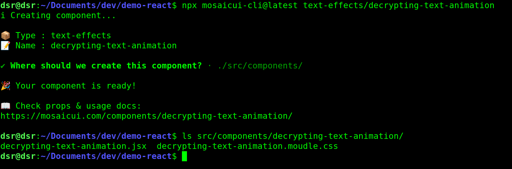

# MosaicUI CLI
Effortlessly add MosaicUI components to your React projects with a CLI.



## Features
- Effortlessly add UI components
- Works seamlessly with React projects
- No installation required (runs via `npx`)
- Easy and intuitive command structure

## Requirements
- Node.js v18 or higher
- React project

## Usage
Run the command from your project root directory (the folder that contains package.json).

```bash
npx mosaicui-cli@latest <component-type>/<component-name>
```

Example:

```bash
npx mosaicui-cli@latest essentials/circular-list
```

## Available Components
Visit the [MosaicUI components](https://mosaicui.com/components/) page to explore all available components.